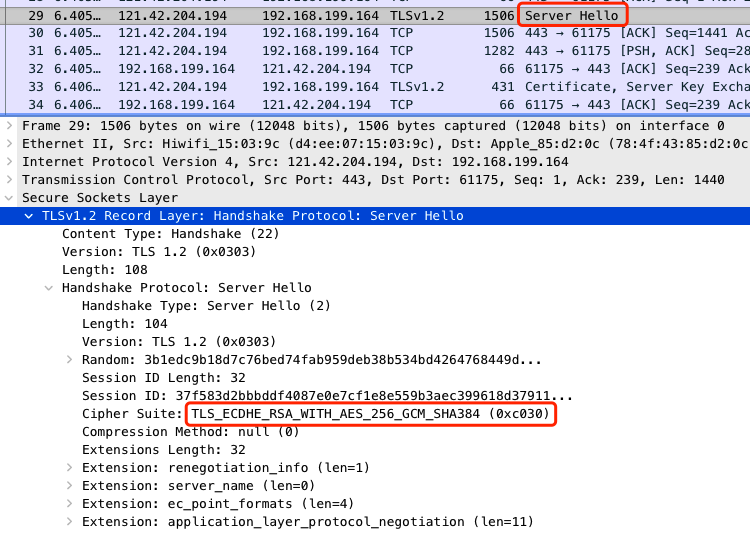
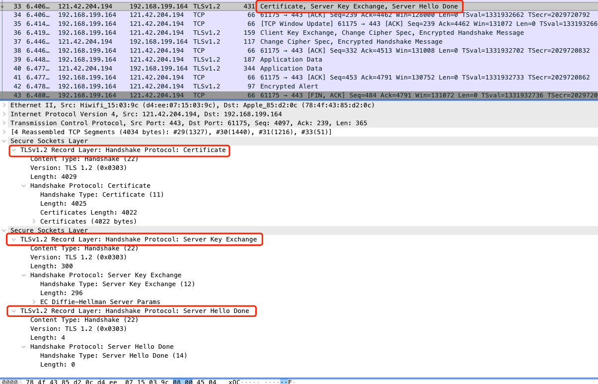
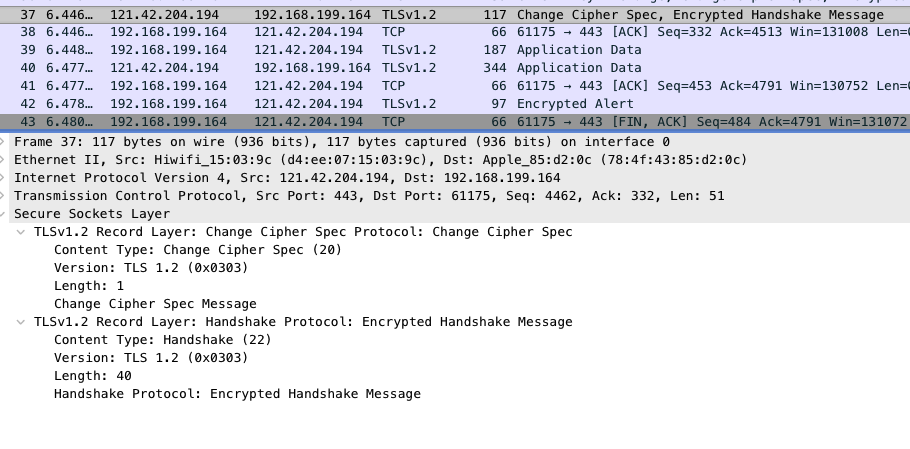

# https 流程

Https介绍

https其实是在http上加了一层(SSL/TSL)加密协议，根据维基百科的解释：

> 超文本传输安全协议（英语：HyperText Transfer Protocol Secure，缩写：HTTPS；常称为HTTP over TLS、HTTP over SSL或HTTP Secure）是一种通过计算机网络进行安全通信的传输协议。
>
> HTTP协议和安全协议同属于应用层（OSI模型的最高层），具体来讲，安全协议工作在HTTP之下，传输层之上：安全协议向运行HTTP的进程提供一个类似于TCP的套接字，供进程向其中注入报文，安全协议将报文加密并注入运输层套接字；或是从运输层获取加密报文，解密后交给对应的进程。严格地讲，HTTPS并不是一个单独的协议，而是对工作在一加密连接（TLS或SSL）上的常规HTTP协议的称呼。


我们用一张图来看看https的网络模型


传统的HTTP由于是明文传输，所以有以下安全风险：

* 数据被窃听：比如用户敏感信息被盗取，造成损失

* 数据被篡改：如之前国内小的运营商经常会篡改网页，加入广告

* 网站被冒充：由于没有身份认证体系，用户无法判断提供服务的网站是否是冒充

而HTTPS通过加入(SSL/TSL)加密协议层，解决了上述三个风险。

接下来将通过抓取一个测试网站的HTTPS数据包，通过Wireshark对每个数据包进行详细分析。

本文的分析中，需要具备一些TCP/IP的基础知识。

### 测试网站

首先我在自己的服务器上部署了一个最简单的网页，https://www.gaotenglife.com/test.html，接下来分析https的流程都会通过抓取这个网址来进行，之所以网站里面只有一个test字符，也是为了分析方便，去掉复杂因素的干扰。一般的https证书都会收费，这里我使用国外一个提供免费https证书的服务商Let's Encrypt进行https证书的申请，证书的详细信息，大家可以点开chrome浏览器左上角的按钮查看。如需自己配置可参考：[Let's Encrypt](https://letsencrypt.org/zh-cn/getting-started/)


### 抓包工具

在这里我们抓包工具使用Wireshark，这个工具是一个非常强大的网络抓包工具，可以用来分析各种底层协议。

在这里提供一个之前内部的Wireshark的分享ppt，可以帮助大家快速了解这个抓包软件，PPT的下载链接也放到文末附录中。

同时我将抓到的网络包放到文章末尾，如果大家抓包不方便，可以直接拿我抓的包进行分析。

分析过程请大家过滤ip.addr == 121.42.204.194 and tcp.port==443，这样就能看到所有与服务器的https的数据包了。


需要注意的是不同浏览器，或者不同的访问网站工具，对于https的具体实现可能有细微的差异。我这里使用的是mac系统下终端的crul命令行工具进行请求的。

```html
curl https://www.gaotenglife.com/test.html

<html>

test

</html>
```


### https数据包分析

Https整体流程图

Https的流程分为两部分，首先是传统的tcp连接的三次握手与四次挥手，

图再找找有否有更好的，或者自己画一张。


接下来结合上图中的流程，我们从抓包的请求中，依次分析相应的数据包。

首先经过tcp的三次握手

tcp中Seq代表当前发送方数据的序号

Ack代表发送方期望下一次收到的数据的序号，言外之意就是，之前序号的数据都已经接受完毕。

client -> server  SYN (Seq=0)

server -> client  SYN ACK (Seq=0,Ack=1)

Client -> server ACK (Seq=1,Ack=1)


然后开始TLS协议

图中1

我们分析TLS协议从24号消息开始，到39号结束，也就是TSL从开始到可以发送数据的过程。


**client -> server  (Client Hello) **

向服务端发送客户端支持的协议，已经使用的TLS版本，发送随机数。从下图中，我们也可以看出SSL层是基于TCP层又进行封装的一层协议。


我们重点看几个TLS协议中的字段。

将Cipher Suites字段展开，如下图。 代表客户端支持的加密协议列表。


协议各个字段代表的含义如下：


第28号消息server->client  (Ack Seq=1 Ack=239)，则是服务端向客户端发送的ACK确认消息，代表上面的Client Hello已经收到。这里也可以看出服务端是通过普通的TCP 的ACK消息去应答Client Hello，看上图中，由于Client Hello 消息占用长度为238，所以回复的Ack就等于1+238 = 239，代表服务端从开始连接到目前已经收到了239序号。

**server -> client (Server Hello)  **



服务端选择了加密协议，包含交换密钥使用的非对称加密算法，数据加密使用的对称密钥算法，数据校验的摘要算法(Cipher Suite: TLS_ECDHE_RSA_WITH_AES_128_GCM_SHA384 (0xc030))，这里详细概述。

ECDHE（Elliptic Curve Diffie-Hellman Ephemeral）: ，密钥协商交换算法，密钥协商的原理稍微复杂一些，早期我们使用RSA非对称加密进行密钥传输，比如Cipher Suites列表中 TLS_RSA_WITH_AES_256_CBC_SHA 这个协议簇，使用RSA加密会导致一个问题，就是如果某台服务器的私钥万一泄漏，过去被第三方截获的所有 TLS 通讯密文都会被破解，即这种算法不支持“前向加密”。想要详细了解RSA密钥交换算法的原理，可以看文章：https://mp.weixin.qq.com/s/U9SRLE7jZTB6lUZ6c8gTKg

为了解决这种问题，就有了DH(Diffie-Hellman)密钥交换算法。而ECDHE也是基于DH算法进行了一些效率的改进。

为了让我们的分析不陷入DH算法的细节中，我们只简单的使用一个例子来形象的说明下DH密钥交换算法的原理。


小张和小李做刷墙工作，他们想选取一种共同的颜色，但是又不想让在旁边的竞争对手听到。那么他们如何统一颜色呢？这个问题的解决方案就是Diffie-Hellman密钥交换算法的最简单形式，接下来我们来一探究竟。

#### 方案步骤

- 1.首先，小张先随便选择一种常见的颜色，比如黄色，作为公共颜色，然后告诉小李，她将在本次会议中使用黄色。显然，竞争对手也可以听到，但是没有关系。
- 2.然后，小张和小李各自选取自己的秘密颜色，他们不会告诉对方。所以竞争对手永远不会知道秘密颜色。例如，小张选橙色作为秘密颜色，小李选绿色。
- 3.接下来，小张将他的秘密颜色橙色和公共颜色黄色混合以产生新的颜色肉色。同理，小李也将他的秘密颜色绿色与公共颜色黄色混合以生成新的蓝色。
- 4.小张和小李把新生成的颜色告诉彼此。这时候竞争对手能看到肉色和蓝色，但不是他们的秘密颜色。
- 5.交换完成后，小张会将她的秘密颜色（橙色）混合到小李发送的混合物（蓝色）中。小李会将他的秘密颜色（绿色）与小张发送的混合物（肉色）混合。
- 6.现在小张和小李都达到了一种共同秘密色彩（棕色）的混合物。但是竞争对手将会被肉色和蓝色困住，不知道小张和小李的秘密颜色，所以竞争对手永远不会得到他们俩得到的共同的秘密颜色。

这里，共同色（黄色）可以被视为服务器的公钥，每个人都可以使用。最后获得的公共秘密可以被认为是用于在进一步的会话中加密数据的对称密钥。

https://xz.aliyun.com/t/2526

RSA：签名算法，

AES-128_GCM:使用AES-128的GCM模式进行对称加密

SHA384:数据摘要算法，即计算hash使用。可以看到这里使用比SHA256更多位数的SHA摘要算法。


**server -> client (Certificate,Server key Exchange,Server Hello Done)**



这里服务端在一个TCP消息中，发送了三个TSL消息。

Certificates：将服务端的数字证书传递给客户端。里面包含了证书链中三个证书。

有兴趣的同学，可以逐一将证书的各个字段展开，进行对比查看。


说到这里，这里简单介绍一下w w w.gaotenglife.com这个证书的构成。

一个数字证书通常包含了：

- 公钥；
- 持有者信息；
- 证书认证机构（CA）的信息；
- CA 对这份文件的数字签名及使用的算法；
- 证书有效期；
- 还有一些其他额外信息；

那数字证书的作用，是用来认证公钥持有者的身份，以防止第三方进行冒充。


​																						图10


上述截图中，encrypted:字段就是私钥加密后的Certificate Signature。我们也可以从chrome中证书查看工具中得到验证。


而图10中提到的用来解密的公钥，就是subjectPublickey字段下面的modulus字段。

Server key Exchange:服务端将公钥参数传递给客户端


之前由于服务端选用ECDHE进行密钥协商，这里传输的内容有：

椭圆曲线域参数，以及公钥的值。为了防止公钥被篡改，这里使用RSA对公钥进行签名。

Server Hello Done:顾名思义，就是Server Hello消息结束


**client -> server (Client Key Exchange, Change Cipher Spec, Encrypted Handshake Message)** 


Client Key Exchange：

客户端发送的，如果客户端收到了服务端的证书，并且验证通过。这里继续进行密钥协商过程，向服务端发送自己的公钥参数等。

Change Cipher Spec：

代表客户端已经生成了新的密钥（对称密钥），通知服务端，之后就使用新的密钥进行通信了。

Encrypted Handshake Message：

这个消息有两个目的：

1.告诉服务端，客户端在握手的过程中收到和发送的数据（其实只是将之前的数据进行hash和加密），保证握手过程中报文没有被修改过

2.如果服务端收到这个消息并能解密成功，就能说明对称密钥是正确的。

Encrypted Handshake Message消息其实不光客户端会发送，之后服务端也会发送一个。


**server -> client (Change Cipher Spec, Encrypted Handshake Message)** 



这里可能大家有个小疑问，为啥36号消息（客户端发送的）发送后，服务端没有回复ACK呢，其实ACK是包含在37号消息中，没有单独发送TCP消息了。从上图中也能看出，Ack：332就代表之前36号消息已经接受完毕。36号消息的Seq=239，len=93，加起来正好是332.

Change Cipher Spec:

服务端也获取到了对称密钥，接下来服务端给客户端传递的消息也都用新的密钥进行加密。

Encrypted Handshake Message:

这个在介绍上一个消息的时候有详细说明，可以回去看看。


最后38消息

38	6.446596	192.168.199.164	121.42.204.194	TCP	66	61175 → 443 [ACK] Seq=332 Ack=4513 Win=131008 Len=0 TSval=1331932702 TSecr=2029720832

客户端给服务端使用TCP回复，也就是37号消息已经收到。


从39号消息开始，便真正开始数据的传输，其中Encrypted Application Data就代表加密后的数据。


最后总结一下，一次完整的Https请求所经历的报文请求。

1. TCP的三次握手
   
2. Client Hello（Client）


3. Server Hello（Server）


4. Certificate（Server）


5. Server Key Exchange （Server）


6. Server Hello Done （Server）


7. Client Key Exchange（Client）


8. Change Cipher Spec（Client）


9. Encrypted Handshake Message（Client）

11. Change Cipher Spec（Server）

12. Encrypted Handshake Message（Server）

13. Application Data（Clinet,Server）


### 附录：

* [Wireshark 使用说明](http://qiniu.gaotenglife.com/Wireshark%20%E4%BD%BF%E7%94%A8%E8%AF%B4%E6%98%8E.pptx)

* 文章中提到的网络抓包文件：[文件下载地址](http://qiniu.gaotenglife.com/gaotenglife_2022.pcapng)

