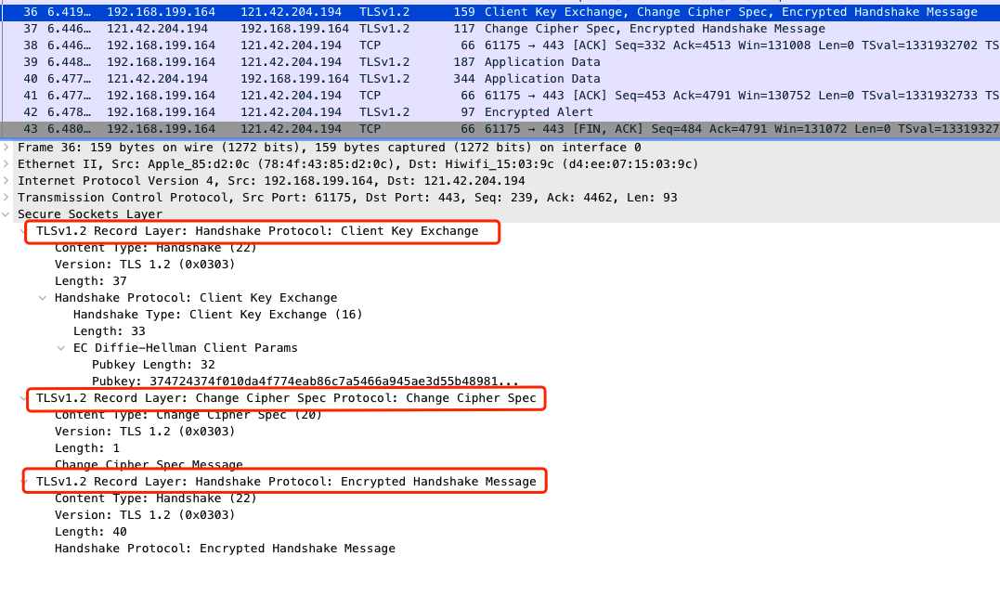

# https 流程

### 测试网站

首先我在自己的服务器上部署了一个最简单的网页，https://www.gaotenglife.com/test.html，接下来分析https的流程都会通过抓取这个网址来进行，之所以网站里面只有一个test字符，也是为了分析方便，去掉复杂因素的干扰。

这个网站使用的https证书是Let's Encrypt提供的免费https证书，证书的详细信息，大家可以点开chrome浏览器左上角的按钮查看

### 抓包工具

在这里我们抓包工具使用Wireshark，这个工具是一个非常强大的网络抓包工具，可以用来分析各种底层协议。

简单介绍一下这个工具。

我将抓到的包放到文章末尾，如果大家抓包不方便，可以直接拿我抓的包进行分析。

分析过程请大家过滤ip.addr == 121.42.204.194 and tcp.port==443，这样就能看到所有与服务器的https的数据包了。

### https数据包分析

Https介绍

https其实是在http上加了一层(SSL/TSL)加密协议，根据维基百科的解释：

> 超文本传输安全协议（英语：HyperText Transfer Protocol Secure，缩写：HTTPS；常称为HTTP over TLS、HTTP over SSL或HTTP Secure）是一种通过计算机网络进行安全通信的传输协议。
>
> HTTP协议和安全协议同属于应用层（OSI模型的最高层），具体来讲，安全协议工作在HTTP之下，传输层之上：安全协议向运行HTTP的进程提供一个类似于TCP的套接字，供进程向其中注入报文，安全协议将报文加密并注入运输层套接字；或是从运输层获取加密报文，解密后交给对应的进程。严格地讲，HTTPS并不是一个单独的协议，而是对工作在一加密连接（TLS或SSL）上的常规HTTP协议的称呼。

我们用一张图来看看https的网络模型

Https整体流程图

Https的流程分为两部分，首先是传统的tcp连接的三次握手与四次挥手，

图再找找有否有更好的，或者自己画一张。

接下来结合上图中的流程，我们从抓包的请求中，依次分析相应的数据包。

首先经过tcp的三次握手

tcp中Seq代表当前发送方数据的序号

Ack代表发送方期望下一次收到的数据的序号，言外之意就是，之前序号的数据都已经接受完毕。

client -> server  SYN (Seq=0)

server -> client  SYN ACK (Seq=0,Ack=1)

Client -> server ACK (Seq=1,Ack=1)

https://segmentfault.com/a/1190000021494676

https://www.runoob.com/w3cnote/http-vs-https.html

然后开始TLS协议

图中1

我们分析TLS协议从134号消息开始，到142号，也就是TSL从开始到可以发送数据的过程。

**client -> server  (Client Hello) **

向服务端发送客户端支持的协议，已经使用的TLS版本，发送随机数。从下图中，我们也可以看出SSL层是基于TCP层又进行封装的一层协议。

我们重点看几个TLS协议中的字段。

将Cipher Suites字段展开，如下图。 代表客户端支持的加密协议列表。我们拿第一个加密协议Cipher Suite: TLS_AES_128_GCM_SHA256 (0x1301)举例，可以从名字上看出，

第135号消息server->client  (Ack Seq=1 Ack=518)，则是服务端向客户端发送的ACK确认消息，代表上面的Client Hello已经收到。这里也可以看出服务端是通过普通的TCP 的ACK消息去应答Client Hello，看上图中，由于Client Hello 消息占用长度为517，所以回复的Ack就等于1+517 = 518，代表服务端从开始连接到目前已经收到了518序号。

**server -> client (Server Hello)  **

包裹的TCP中（Seq:1 Ack:518 Len:1436），到这里服务端连续发了两个消息，上面的135号，和现在的136。由于目前为止接受到客户端传来的消息总长度仍然是518，所以136号消息中，我们的ACK依然和135号中是一样的，也是518。

服务端选择了加密协议，包含交换密钥使用的非对称加密算法，数据加密使用的对称密钥算法，数据校验的摘要算法(Cipher Suite: TLS_ECDHE_RSA_WITH_AES_128_GCM_SHA256 (0xc02f))，这里详细概述。ECDHE_RSA：密钥协商交换算法，使用AES-128的GCM模式进行对称加密，同时以带SHA-256的RSA作为签名算法。

**server -> client (Certificate,Server key Exchange,Server Hello Done)**

这里服务端在一个TCP消息中，发送了三个TSL消息。

Certificate：将服务端的数字证书传递给客户端。我们可以点击chrome中查看证书，R3和下级的www.gaotenglife.com就对应于

Certificate: 3082052c30820414a00302010202120377859c9714b8a1ae... (id-at-commonName=www.gaotenglife.com)

和

Certificate: 308204653082034da0030201020210400175048314a4c821... (id-at-commonName=R3,id-at-organizationName=Let's Encrypt,id-at-countryName=US)

有兴趣的同学，可以逐一将证书的各个字段展开，进行对比查看。（这里注意文末提供的抓包由于是早些时候抓取的，证书中的信息和目前网站中用chrome查看的信息是不一致的，如果需要统一，需要同学们自己抓去最新网站的包，来进行验证）

Server key Exchange:服务端将公钥参数传递给客户端

之前由于服务端选用ECDHE进行密钥协商，这里传输的内容有：椭圆曲线域参数，以及公钥的值。

Server Hello Done:顾名思义，就是Server Hello消息结束

接下来138号消息，客户端向服务端回复ACK，表示之前137号消息已经收到。

**client -> server (Client Key Exchange, Change Cipher Spec, Encrypted Handshake Message)** 

Client Key Exchange：

客户端发送的，如果客户端收到了服务端的证书，并且验证通过。这里继续进行密钥协商过程，向服务端发送自己的公钥参数等。

Change Cipher Spec：

代表客户端已经生成了新的密钥（对称密钥），通知服务端，之后就使用新的密钥进行通信了。

Encrypted Handshake Message：

这个消息有两个目的：

1.告诉服务端，客户端在握手的过程中收到和发送的数据（其实只是将之前的数据进行hash和加密），保证握手过程中报文没有被修改过

2.如果服务端收到这个消息并能解密成功，就能说明对称密钥是正确的。

Encrypted Handshake Message消息其实不光客户端会发送，之后服务端也会发送一个。

**server -> client (New Session Ticket, Change Cipher Spec, Encrypted Handshake Message)** 

这里可能大家有个小疑问，为啥139号消息（客户端发送的）发送后，服务端没有回复ACK呢，其实ACK是包含在140消息中，没有单独发送TCP消息了。从上图中也能看出，Ack：611就代表之前139号消息已经接受完毕。139号消息的Seq=518，len=93，加起来正好是611.

New Session Ticket:

这个消息的主要目的是服务端生成一个会话，并且设置一个超时时间（Session Ticket Lifetime Hint），在这段时间内，都可以使用杠杆协商交换好的对称密钥进行通信。

Change Cipher Spec:

服务端也获取到了对称密钥，接下来服务端给客户端传递的消息也都用新的密钥进行加密。

Encrypted Handshake Message:

这个在介绍上一个消息的时候有详细说明，可以回去看看。

最后141消息

141	10.353870	10.2.138.59	121.42.204.194	TCP	66	56456 → 443 [ACK] Seq=611 Ack=3138 Win=130752 Len=0 TSval=71526937 TSecr=1730183157

客户端给服务端使用TCP回复，也就是140的消息已经收到。

从142开始，便真正开始数据的传输，其中Encrypted Application Data就代表加密后的数据。

附录：

文章中提到的抓包文件：[文件下载地址](http://qiniu.gaotenglife.com/gaotenglife.pcapng)

