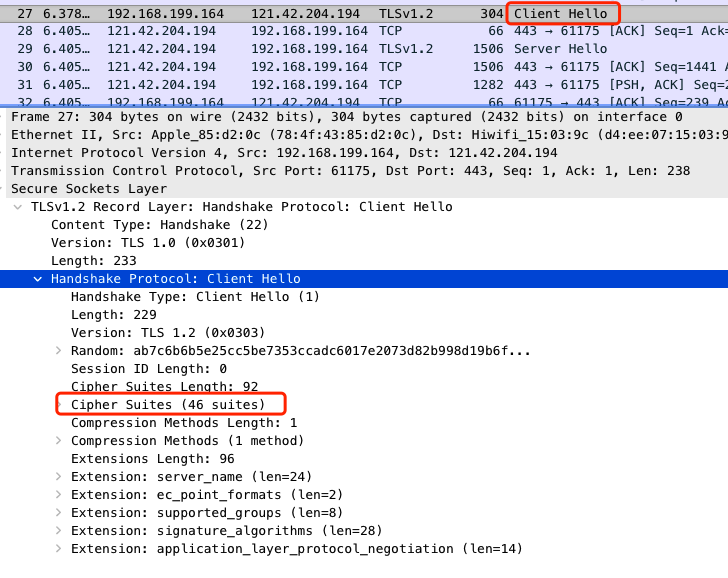

# https 流程

### 测试网站

首先我在自己的服务器上部署了一个最简单的网页，https://www.gaotenglife.com/test.html，接下来分析https的流程都会通过抓取这个网址来进行，之所以网站里面只有一个test字符，也是为了分析方便，去掉复杂因素的干扰。

这个网站使用的https证书是Let's Encrypt提供的免费https证书，证书的详细信息，大家可以点开chrome浏览器左上角的按钮查看

### 抓包工具

在这里我们抓包工具使用Wireshark，这个工具是一个非常强大的网络抓包工具，可以用来分析各种底层协议。

我将抓到的包放到文章末尾，如果大家抓包不方便，可以直接拿我抓的包进行分析。

分析过程请大家过滤ip.addr == 121.42.204.194 and tcp.port==443，这样就能看到所有与服务器的https的数据包了。

### https数据包分析

Https介绍

https其实是在http上加了一层(SSL/TSL)加密协议，根据维基百科的解释：

> 超文本传输安全协议（英语：HyperText Transfer Protocol Secure，缩写：HTTPS；常称为HTTP over TLS、HTTP over SSL或HTTP Secure）是一种通过计算机网络进行安全通信的传输协议。
>
> HTTP协议和安全协议同属于应用层（OSI模型的最高层），具体来讲，安全协议工作在HTTP之下，传输层之上：安全协议向运行HTTP的进程提供一个类似于TCP的套接字，供进程向其中注入报文，安全协议将报文加密并注入运输层套接字；或是从运输层获取加密报文，解密后交给对应的进程。严格地讲，HTTPS并不是一个单独的协议，而是对工作在一加密连接（TLS或SSL）上的常规HTTP协议的称呼。

我们用一张图来看看https的网络模型

Https整体流程图

Https的流程分为两部分，首先是传统的tcp连接的三次握手与四次挥手

首先经过tcp的三次握手

tcp中Seq代表当前发送方数据的序号

Ac k代表发送方期望下一次收到的数据的序号，言外之意就是，之前序号的数据都已经接受完毕。

client -> server  SYN (Seq=0)

server -> client  SYN ACK (Seq=0,Ack=1)

Client -> server ACK (Seq=1,Ack=1)

https://segmentfault.com/a/1190000021494676

https://www.runoob.com/w3cnote/http-vs-https.html

然后开始TLS协议

图中1

**client -> server  (Client Hello) **

向服务端发送客户端支持的协议，已经使用的TLS版本，发送随机数。

我们重点看几个TLS协议中的字段，Cipher

**server -> client (Server Hello)  **

服务端选择了加密协议，包含交换密钥使用的非对称加密算法，数据加密使用的对称密钥算法，数据校验的摘要算法(Cipher Suite: TLS_ECDHE_RSA_WITH_AES_128_GCM_SHA256 (0xc02f))

**server -> client (Certificate,Server key Exchange,Server Hello Done)**

