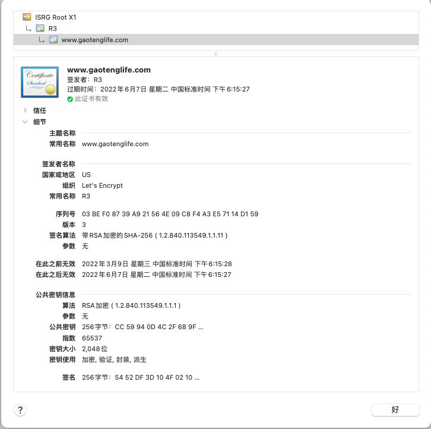
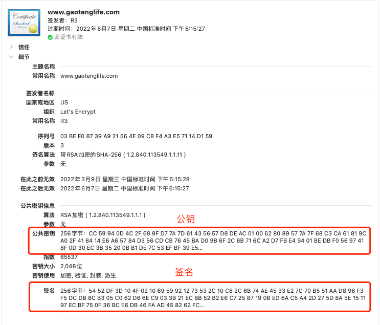
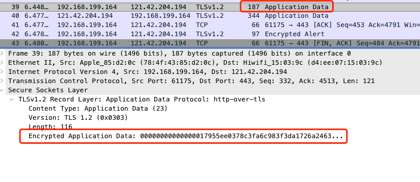

# 通过抓包深入分析HTTPS

### Https介绍

https其实是在http上加了一层(SSL/TSL)加密协议，根据维基百科的解释：

> 超文本传输安全协议（英语：HyperText Transfer Protocol Secure，缩写：HTTPS；常称为HTTP over TLS、HTTP over SSL或HTTP Secure）是一种通过计算机网络进行安全通信的传输协议。
>
> HTTP协议和安全协议同属于应用层（OSI模型的最高层），具体来讲，安全协议工作在HTTP之下，传输层之上：安全协议向运行HTTP的进程提供一个类似于TCP的套接字，供进程向其中注入报文，安全协议将报文加密并注入运输层套接字；或是从运输层获取加密报文，解密后交给对应的进程。严格地讲，HTTPS并不是一个单独的协议，而是对工作在一加密连接（TLS或SSL）上的常规HTTP协议的称呼。


我们用一张图来看看https的网络模型


<center>图1. https网络模型图</center>

传统的HTTP由于是明文传输，所以有以下安全风险：

* 数据被窃听：比如用户敏感信息被盗取，造成损失

* 数据被篡改：如之前国内小的运营商经常会篡改网页，加入广告

* 网站被冒充：由于没有身份认证体系，用户无法判断提供服务的网站是否是冒充

而HTTPS通过加入(SSL/TSL)加密协议层，解决了上述三个风险。

接下来将通过抓取一个测试网站的HTTPS数据包，通过Wireshark对每个数据包进行详细分析。

本文的分析中，需要具备一些TCP/IP的基础知识。

### 测试网站

首先我在自己的服务器上部署了一个最简单的网页，https://www.gaotenglife.com/test.html，接下来分析https的流程都会通过抓取这个网址来进行，之所以网站里面只有一个test字符，也是为了分析方便，去掉复杂因素的干扰。一般的https证书都会收费，这里我使用国外一个提供免费https证书的服务商Let's Encrypt进行https证书的申请，证书的详细信息，大家可以点开chrome浏览器左上角的按钮查看。如需自己配置可参考：[Let's Encrypt](https://letsencrypt.org/zh-cn/getting-started/)


<center>图2</center>



<center>图3. chrome浏览器证书查看</center>

### 抓包工具

在这里我们抓包工具使用Wireshark，这个工具是一个非常强大的网络抓包工具，可以用来分析各种底层协议。

在这里提供一个之前内部的Wireshark的分享ppt，可以帮助大家快速了解这个抓包软件，PPT的下载链接也放到文末附录中。

同时我将抓到的网络包放到文章末尾，如果大家抓包不方便，可以直接拿我抓的包进行分析。

分析过程请大家过滤ip.addr == 121.42.204.194 and tcp.port==443，这样就能看到所有与服务器的https的数据包了。

需要注意的是不同浏览器，或者不同的访问网站工具，对于https的具体实现可能有细微的差异。我这里使用的是mac系统下终端的crul命令行工具进行请求的。

```html
curl https://www.gaotenglife.com/test.html

<html>

test

</html>
```


<center>图4. Wireshark过滤条件</center>


### https数据包分析


<center>图5.Https整体流程图 </center>

图5中的流程可以先简单有一个印象，接下来会结合上图中的流程，我们从抓包的请求中，依次分析相应的数据包。

Https的流程分为两部分，通过之前图1的网络模型可知，Https是在http中间加了一层，所以Https建立连接使用的仍然是tcp的三次握手。三次握手的包如下图6.由于Seq和Ack后面还会经常提到，所以我们简单描述下Seq与Ack的含义，关于TCP三次握手的详细过程，这里就不在展开叙述，有兴趣的同学可以参考网络上关于TCP三次握手的文章。

Tcp中Seq代表当前发送方数据的序号，单位是字节

Ack代表发送方期望下一次收到的数据的序号，言外之意就是，之前序号的数据都已经接受完毕。

client -> server  SYN (Seq=0)

server -> client  SYN ACK (Seq=0,Ack=1)

Client -> server ACK (Seq=1,Ack=1)


<center>图6.TCP三次握手 </center>

Tcp的三次握手结束后，Tcp的连接已经建立，下面就开始TLS协议建立的过程。


#### client -> server  (Client Hello) 

向服务端发送 1.客户端支持的协议；2.已经使用的TLS版本；3.随机数Random。这里我们将随机数记为Random1，记住这个随机数，后面还会提到。从下图中，我们也可以看出SSL层是基于TCP层又进行封装的一层协议。


<center>图7.Client Hello </center>

我们重点看几个TLS协议中的字段。

将Cipher Suites字段展开，如下图。 代表客户端支持的加密协议簇列表。由于本次抓包使用的是curl工具，我们可以看到里面支持46种协议簇。每种协议簇代表不同的加密方式。不同的客户端支持的列表会有所不同，比如我的Chrome浏览器就只支持18种。


<center>图8.支持的加密协议簇列表 </center>

协议各个字段代表的含义如下：


<center>图9.协议簇各个字段含义 </center>


客户端发送完Client Hello（第27号报文），第28号报文server->client  (Ack Seq=1 Ack=239)，则是服务端向客户端发送的ACK确认消息，代表上面的Client Hello已经收到。这里也可以看出服务端是通过普通的TCP 的ACK消息去应答Client Hello，看上图7中，由于Client Hello 消息占用长度为238，所以回复的Ack就等于1+238 = 239，代表服务端从开始连接到目前已经收到了239序号。

#### server -> client (Server Hello)


<center>图10.Server Hello报文 </center>

服务端也生成了一个随机数，发送给了客户端，我们记为Random2。到目前为止客户端和服务的都已经拥有了(Random1和Random2)。同时服务端选择了一种加密协议簇作为后续与客户端交互的协议。

此协议簇中包含密钥协商算法，数据加密使用的对称密钥算法，数据校验的摘要算法(Cipher Suite: TLS_ECDHE_RSA_WITH_AES_128_GCM_SHA384 (0xc030))。我们结合图9中各个字段的描述，来进行分析。

* **第一个字段  ECDHE（Elliptic Curve Diffie-Hellman Ephemeral **: ，密钥协商交换算法，密钥协商的原理稍微复杂一些，早期我们使用RSA非对称加密进行密钥传输，比如Cipher Suites列表中 TLS_RSA_WITH_AES_256_CBC_SHA 这个协议簇，使用RSA加密会导致一个问题，就是如果某台服务器的私钥万一泄漏，过去被第三方截获的所有 TLS 通讯密文都会被破解，即这种算法不支持“前向加密”。想要详细了解RSA密钥交换算法的原理，可以看文章：https://mp.weixin.qq.com/s/U9SRLE7jZTB6lUZ6c8gTKg

​		为了解决这种问题，就有了DH(Diffie-Hellman)密钥交换算法。而ECDHE也是基于DH算法进行了一些效率的改进。

​		为了让我们的分析不陷入DH算法的细节中，我们只简单的使用一个例子来形象的说明下DH密钥交换算法的原理。


<center>图11.DH密钥交换算法形象图 </center>

​			小张和小李做刷墙工作，他们想选取一种共同的颜色，但是又不想让在旁边的竞争对手听到。那么他们如何统一颜色呢？这个问			题的解决方案就是Diffie-Hellman密钥交换算法的最简单形式，接下来我们来一探究竟。

​			1.首先，小张先随便选择一种常见的颜色，比如黄色，作为公共颜色，然后告诉小李，她将在本次会议中使用黄色。显然，竞争对			   手也可以听到，但是没有关系。

​			2.然后，小张和小李各自选取自己的秘密颜色，他们不会告诉对方。所以竞争对手永远不会知道秘密颜色。例如，小张选橙色作为			   秘密颜色，小李选绿色。

​			3.接下来，小张将他的秘密颜色橙色和公共颜色黄色混合以产生新的颜色肉色。同理，小李也将他的秘密颜色绿色与公共颜色黄色			   混合以生成新的蓝色。

​			4.小张和小李把新生成的颜色告诉彼此。这时候竞争对手能看到肉色和蓝色，但不是他们的秘密颜色。

​			5.交换完成后，小张会将她的秘密颜色（橙色）混合到小李发送的混合物（蓝色）中。小李会将他的秘密颜色（绿色）与小张发送			   的混合物（肉色）混合。

​			6.现在小张和小李都达到了一种共同秘密色彩（棕色）的混合物。但是竞争对手将会被肉色和蓝色困住，不知道小张和小李的秘密			   颜色，所以竞争对手永远不会得到他们俩得到的共同的秘密颜色。

​		这里，共同色（黄色）可以被视为服务器的公钥，每个人都可以使用。最后获得的共同秘密颜色可以被认为是用于在进一步的会话中加密数据的对称密钥。

* **第二个字段  RSA**：签名算法，主要目的是为了对身份进行鉴权。

* **第三个字段 AES-128_GCM**: 使用AES-128的GCM模式进行对称加密，也就是加密和解密使用同一个密钥

* **第四个字段 SHA384**: 数据摘要算法，即计算hash使用。可以看到这里使用比SHA256更多位数的SHA摘要算法。这里使用摘要算法的目的主要是用于验证数据的完整性，防止信息被篡改。


#### server -> client (Certificate,Server key Exchange,Server Hello Done)


<center>图12.Certificate,Server key Exchange,Server Hello Done </center>

这里服务端在一个TCP消息中，发送了三个TSL消息。

* **Certificates**：将服务端的数字证书传递给客户端。里面包含了证书链中三个证书。

​		有兴趣的同学，可以逐一将证书的各个字段展开，进行对比查看。


<center>图13.报文中证书链 </center>


<center>图14.Chrome浏览器中查看证书链 </center>

​	说到这里，这里简单介绍一下www.gaotenglife.com这个证书的构成。

​	一个数字证书通常包含了：

			1. 公钥；
			1. 持有者信息；
			1. 证书认证机构（CA）的信息；
			1. CA 对这份文件的数字签名及使用的算法；
			1. 证书有效期；
			1. 还有一些其他额外信息；

那数字证书的作用，是用来认证公钥持有者的身份，以防止第三方进行冒充。那么客户端是如何验证证书的合法性呢。如下图15所示

服务端将证书的先做hash摘要，然后用CA 的私钥进行加密，随后将证书连同CA的公钥一起下发给客户端，客户端拿到加密后的签名，通过公钥解密，然后将解密后hash摘要与接收到的证书再进行一次hash摘要，两个hash值对比，既可以判断出证书是否合法。


<center>图15.证书验证过程 </center>


<center>图16.报文中证书的公钥与签名 </center>

在图16中，encrypted:字段就是图15 CA 私钥加密后的Certificate Signature。这也就代表证书的签名，可以防止证书被伪造。我们也可以从chrome中证书查看工具中得到验证。



<center>图17.chrome浏览器中查看证书的公钥与签名 </center>

而图15中提到的用来解密的公钥，就是subjectPublickey字段下面的modulus字段。

从图15的流程中我们看出，客户端经过对证书的校验，防止了中间人攻击中伪造证书的漏洞。

* **Server key Exchange**:


<center>图18.ECDHE密钥协商 </center>

​		之前由于服务端选用ECDHE进行密钥协商，这里传输的内容有：

​		椭圆曲线域参数，以及公钥的值。为了防止公钥被篡改，这里使用RSA对公钥进行签名。

* **Server Hello Done** :  顾名思义，就是Server Hello消息结束，这个消息中没有额外的其他字段。


#### client -> server (Client Key Exchange, Change Cipher Spec, Encrypted Handshake Message)


<center>图19.Client Key Exchange, Change Cipher Spec, Encrypted Handshake Message </center>

该报文中，也是将TLS的三个消息合并到一个TCP消息中发送

* **Client Key Exchange**：

​	客户端发送的，如果客户端收到了服务端的证书，并且验证通过。这里继续进行密钥协商过程，向服务端发送自己的公钥参数等。客户端验证证书的过程这里就不再阐述，大家可以返回去看图15的过程。

* **Change Cipher Spec**：

  这一步中客户端使用之前Radom1，Radom2，和图18中传递给客户端的协商参数生成了新的对称密钥。

​		发送该报文代表客户端已经生成了新的密钥（对称密钥），通知服务端，之后就使用新的密钥进行通信了。

* **Encrypted Handshake Message**：

​		这个消息有两个目的：

​			1. 告诉服务端，客户端在握手的过程中收到和发送的数据（其实只是将之前的数据进行hash和加密），保证TSL握手过程中报文没				有被修改过

​			2.如果服务端收到这个消息并能解密成功，就能说明对称密钥是正确的。目的就是为了测试一下使用新的密钥有没有问题。

​			   Encrypted Handshake Message消息其实不光客户端会发送，之后服务端也会发送一个。


**server -> client (Change Cipher Spec, Encrypted Handshake Message)** 


这里可能大家有个小疑问，为啥36号消息（客户端发送的）发送后，服务端没有回复ACK呢，其实ACK是包含在37号消息中，没有单独发送TCP消息了。从上图中也能看出，Ack：332就代表之前36号消息已经接受完毕。36号消息的Seq=239，len=93，加起来正好是332.

* **Change Cipher Spec**:

  同客户端一样，服务端也使用之前Radom1，Radom2和图19中客户端发来的EC Diffie-Hellman Client Params参数生成了对称密钥。而这个对称密钥和客户端的是一样的。这个报文就代表服务端也获取到了对称密钥，接下来服务端给客户端传递的消息也都用新的密钥进行加密。同时使用刚刚生存的对称密钥尝试将客户端发来的Encrypted Handshake Message进行解密，来验证TSL握手阶段没有被篡改。

* **Encrypted Handshake Message**:

​		这个在介绍上一个报文消息的时候有详细说明，可以回去看看。


最后38号报文客户端给服务端使用TCP回复，也就是37号报文已经收到。

经过上面一系列的过程，我们终于将对称密钥协商好了。我们可以看到使用Https协商密钥的过程还是很复杂的，而且需要经过多次TCP报文的往返才能协商一致，这也是Https相比http慢的原因。同时由于涉及非对称加解密对服务器cpu的消耗也会有所增加。


从39号报文开始，便是正在传递数据的报文了。其中Encrypted Application Data就代表加密后的数据。



最后我们用一张图来总结回顾一下一次完整的Https请求所经历的报文请求。


### 附录：

* [Wireshark 使用说明](http://qiniu.gaotenglife.com/Wireshark%20%E4%BD%BF%E7%94%A8%E8%AF%B4%E6%98%8E.pptx)

* 文章中提到的网络抓包文件：[文件下载地址](http://qiniu.gaotenglife.com/gaotenglife_2022.pcapng)

